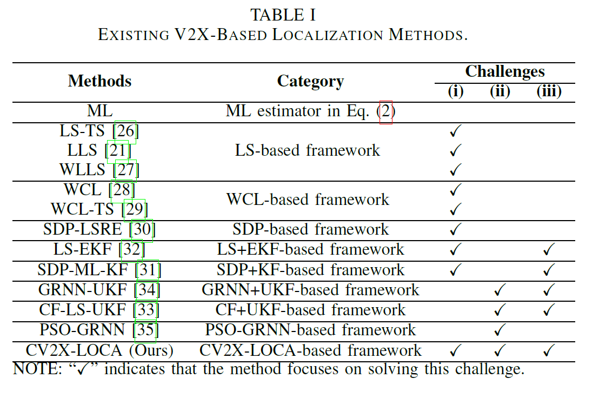

# CV2X-LOCA
This repo is the implementation of the paper "Toward C-V2X Enabled Connected Transportation System: RSU-Based Cooperative Localization Framework for Autonomous Vehicles".


## Overview
CV2X-LOCA innovatively uses C-V2X channel state information to achieve lane-level positioning accuracy. 

<div align=center></div>

It is composed of four modules:
- Data Processing Module: Standardizes and processes incoming data for accurate localization.
- Coarse Positioning Module: Overcomes non-convex optimization challenges by approximating ML estimators, ensuring robust vehicle localization.
- Environment Parameter Correcting Module: Adapts to environmental variations by dynamically adjusting signal propagation models, crucial for handling traffic scenarios heterogeneity.
- Vehicle Trajectory Filtering Module: Enhances localization precision through advanced filtering techniques, addressing spatio-temporal constraints effectively.

## Data Generation
This section outlines the simulation data included in this repository, generated within a Matlab environment to support the testing and validation of localization algorithms against the CV2X-LOCA framework. The data simulate real-world conditions to ensure the relevance and applicability of our findings to actual autonomous vehicle localization challenges.

### RSS Data (`rssi_noise.mat`)
Generated through Eq. (1), considering noise fluctuations and adjusting environmental parameters (γ) to mimic various road environments, reflecting the heterogeneity of urban traffic scenarios.

### Vehicle Trajectory Data (`trace_1.mat`)
Utilizes the constant velocity lane changing (CVLC) model for simulating realistic vehicle trajectories, assuming no acceleration or braking.

### RSUs Coordinate Data (`AP.mat`)
Deployed in a simulated two-way, four-lane road segment, with RSUs positioned on both sides to ensure angle diversity of measurements and reduce lateral dilution of precision.

### Distance Data from Vehicle to Each RSU (`real_d.mat`)
Calculated based on the simulated positions of vehicles and RSUs, providing essential data for assessing localization algorithm effectiveness.

### Attenuation Factor Value (`A.mat`)
Adjusts signal propagation models dynamically to accommodate various environmental conditions, enhancing the framework's adaptability.

The datasets were specifically generated to tackle the three main challenges identified in our research: non-convex objective function optimization, adaptation to traffic scenarios' heterogeneity, and managing spatio-temporal constraints. These datasets not only serve as a benchmark for the CV2X-LOCA framework but also enable researchers to validate their own localization algorithms under similar conditions.


## Models
The repository hosts implementations of several localization models that we have compared in our paper. These models are integral to the comparative analysis we conducted to demonstrate the effectiveness of our proposed CV2X-LOCA framework in addressing specific challenges in vehicle localization.

The following models are included:
- WCL
- WLLS
- LS-EKF
- GRNN-UKF
- CV2X-LOCA (named SDP_A_UKF)

Each model addresses different aspects of the localization challenges as indicated in the table below:

<div align=center></div>

_NOTE: The checkmarks in the table denote which challenges each method is focused on addressing, providing an at-a-glance comparison of their capabilities._

The code for each model is provided, allowing researchers to replicate our findings and further explore the performance of these models in their own simulations.

# Preparation
Install the dependent package

e.g., 

`ML-True, are solved by the MATLAB function lsqnonlin`

`The SDP-based methods, including SDP-LSRE, SDP-ML-KF, and CV2X-SDP (our), are solved by using the MATLAB package CVX , which the solver is SeDuMi.`

# Getting started
Run model

``` 
main.m
``` 

After finishing, the module will automatically calculate the error of this run and save it in the same directory. Including:
- X-axis maximum error
- X-axis minimum error
- Y-axis maximum error
- Y-axis minimum error
- MAPE
- MAE
- MEAN
- RMSE


<div align=center></div>


# Project Structure
CV2X-LOCA/  
├── Algorithm/  
│ ├── CF/  
│ ├── CF_UKF/  
│ ├── GRNN/  
│ ├── GRNN_UKF/  
│ ├── LSE/  
│ ├── LSE_KF/  
│ ├── SDP/  
│ ├── SDP_A_UKF/  
│ ├── WCL/  
│ └── WLSE/  
├── Demo/  
├── Environment_setting/  
├── Results/  
├── LICENSE  
└── README.md  


# Reference
If you find this repo to be useful in your research, please consider citing our work.

*Huang, Z., Chen, S., Pian, Y., Sheng, Z., Ahn, S., & Noyce, D. A. (2023). CV2X-LOCA: Roadside Unit-Enabled Cooperative Localization Framework for Autonomous Vehicles. arXiv preprint arXiv:2304.00676.*


# Limitations
Due to time limitation, there are still some unstandardized parts of the code in this project. The author is working hard to maintain and update the code of CV2X-LOCA, please kindly follow up.

Thank you~


